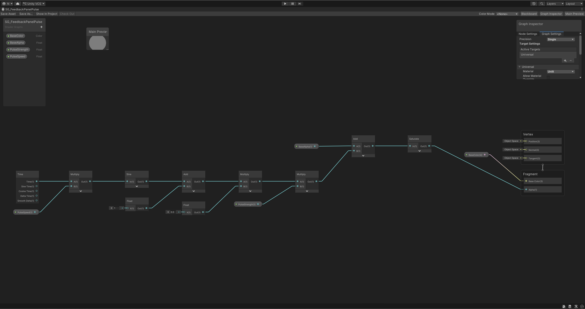
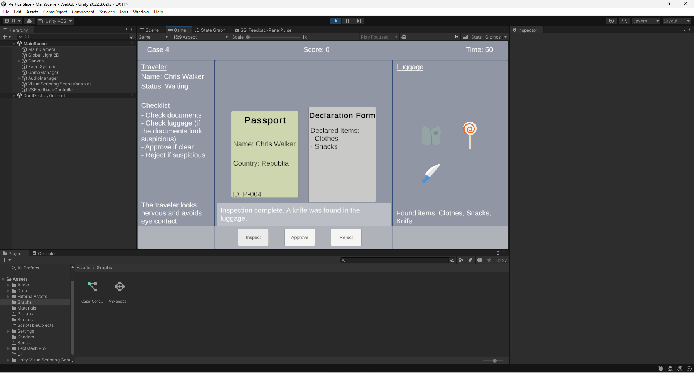
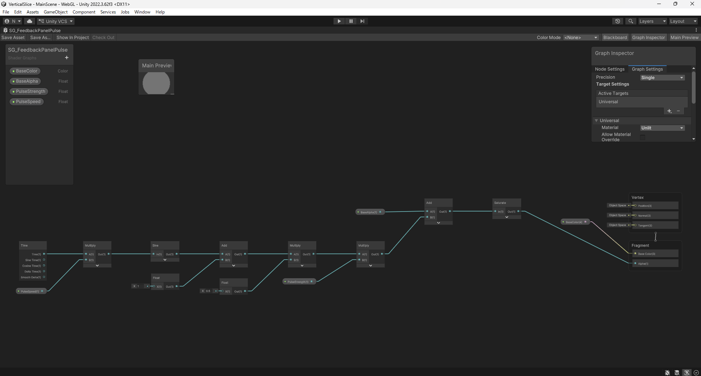
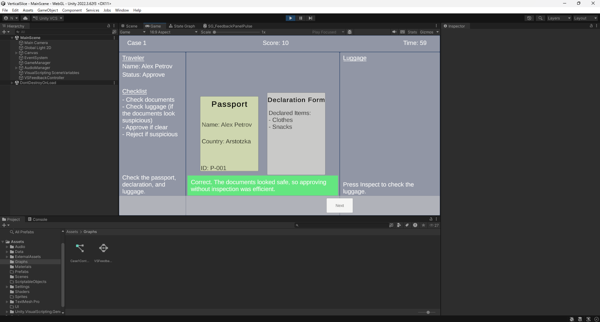

# GDIM33 Vertical Slice
## Milestone 1 Devlog
### Visual Scripting Graph Explanation
For this build, I used a Visual Scripting State Machine called `VSFeedbackStateMachine`. This graph has two states: `Waiting` and `DecisionFeedback`. The game starts in the `Waiting` state while the player is checking the traveler’s documents and luggage. When the player clicks Approve or Reject, my C# script sends a custom event called `DecisionMade` to the Visual Scripting graph. This event triggers the transition from `Waiting` to `DecisionFeedback`. I also added a Debug Log in the `DecisionFeedback` state to confirm that the state machine is working. The main gameplay is controlled by C#, but this graph handles the state change after the player makes a decision.

### Updated Break-down

I updated my break-down by adding the state machine system. In the previous version, the break-down mainly showed the documents, luggage, buttons, timer, score, and feedback UI. In the updated version, I added `VSFeedbackStateMachine` and connected it to the decision buttons and the feedback system. The Approve and Reject buttons call the main case manager script, and then the script sends the `DecisionMade` event to the state machine.

The state machine starts in the `Waiting` state while the player is checking the case. After the player chooses Approve or Reject, it moves to the `DecisionFeedback` state. This state is related to the feedback UI because the game shows whether the decision was correct or not after the decision is made. It is also related to the score system because the score changes at the same time. For Milestone 1, this state machine is simple, but it helps organize the game flow and can be expanded later with more states, such as Tutorial, Inspecting, Result, and NextCase.

## Milestone 2 Devlog
### 1. Feature summary and task break-down
For Milestone 2, I worked on adding multiple traveler cases instead of only one case. The player can now inspect three travelers, make decisions for each one, and see the final score after all cases are finished.

1. Create multiple case data
   1. Make three traveler cases.
   2. Give each case different passport, declaration, luggage, and correct decision data.
   3. Test that each case can show different text and luggage items.
   

2. Build case progression
   1. Add a current case number.
   2. Use the Next button to move to the next traveler.
   3. Reset the screen state when the next case starts.
   4. Hide buttons after the last case.
   

3. Add scoring and ending
   1. Give points for correct decisions.
   2. Subtract time when the player uses Inspect.
   3. Show the final score after all three travelers are judged.
   4. Test the full gameplay from Case 1 to the final result.

I accomplished the main version of this feature. The game now has three playable traveler cases, case progression, inspection time cost, scoring, and a final score screen.

### 2. Reflection on the W5 task break-down
The W5 task break-down helped because it made the feature smaller and easier to test. Instead of trying to build the whole system at once, I worked on case data, case progression, and scoring separately.

If I did this again, I would write clearer test steps for each part. For example, I would write exactly what should happen after pressing Next, Approve, Reject, and Inspect.

### 3. Bridge between Visual Scripting and code
My game uses both C# and Visual Scripting. The main gameplay logic is handled in `SimpleCase1Manager.cs`, which loads the case data, updates the UI, checks the player decision, changes the score, and moves to the next case.

Visual Scripting is used for the feedback state system. When the player chooses Approve or Reject, the C# decision logic connects to the `VSFeedbackController` State Graph, which changes from the `Waiting` state to the `DecisionFeedback` state. This helps show that the game has moved from normal case checking into the result/feedback phase.

### 4. Unity system used for Feature 3
For Feature 3, please grade my ScriptableObject system. The case data is stored in `Assets/Data/Cases`, and each `TravelerCaseData` asset contains information such as traveler name, passport data, declared items, found luggage items, correct decision, score values, and feedback text.

This system is useful because I can add or edit traveler cases without rewriting the main game code. It also makes the project easier to expand from three cases to five cases later.

## Milestone 3 Devlog
### 1.
I used Shader Graph for the feedback message panel. The shader can be found in the game after the player makes an Approve or Reject decision. If the decision is correct, the feedback panel becomes green. If the decision is wrong, the feedback panel becomes red.
Technically, the shader uses exposed properties such as BaseColor, BaseAlpha, PulseStrength, and PulseSpeed. It uses nodes like Time, Sine, Multiply, and Add to make a simple pulsing color/alpha effect. The final color is sent to the fragment output, so the panel color changes visually during gameplay. I use different materials for normal, correct, and wrong feedback, so the same feedback panel can show different visual states.

### 2.
Based on playtesting, I found that players sometimes pressed buttons before fully understanding the rules. Also, after the game started, the tutorial disappeared, so players could not check the rules again. To improve this, I added a tutorial toggle. The tutorial still appears at the beginning, but now the player can press H at any time to show or hide it. This makes the rules easier to check during gameplay without restarting the game.

### 3.
Since the last milestone, I added a fourth case to extend the main gameplay loop. The player now checks four travelers instead of three before reaching the final result screen. I also added a new luggage item, a knife, as hidden contraband in Case 4. This gives the player another reason to use the Inspect button and makes the decision loop more complete: read the documents, decide whether to inspect, check the luggage, then approve or reject the traveler.

## Final Devlog
### 1.
My game is a Papers, Please-like customs inspection game. The core loop is: read the traveler’s passport and declaration form, decide whether to inspect the luggage, then approve or reject the traveler. Inspecting the luggage gives more information, but it costs 5 seconds, so the player has to balance speed and accuracy. This final version has 5 traveler cases and a final score screen, so it shows the main gameplay loop I planned for my Vertical Slice.

### 2.
My rendering effect is used on the feedback message panel after the player makes a decision. The Shader Graph is `SG_FeedbackPanelPulse`. It uses exposed properties like `BaseColor`, `BaseAlpha`, `PulseStrength`, and `PulseSpeed`. The graph uses nodes such as `Time`, `Multiply`, `Sine`, `Add`, and `Saturate` to create a pulsing alpha effect. In `SimpleCase1Manager.cs`, the game checks if the player’s decision is correct or wrong. If it is correct, the script applies the green feedback material. If it is wrong, it applies the red feedback material. This makes the rendering effect respond to gameplay logic.

### 3.
For a large project, I think it is important to break it down into smaller systems first. In this project, I separated the game into systems such as traveler case data, document and luggage display, decision checking, timer and score, tutorial toggle, feedback, shader materials, and audio. I plan to keep using task step break-downs in future projects because they help me decide what to implement first and what can wait. Bubble diagrams are also useful at the early planning stage, but task step break-downs were more useful for me when I was actually building the game in Unity.

Breaking a large project into small steps helped me understand the real scope of the project. At first, the game idea sounded simple, but each feature had many smaller tasks, such as making the UI, connecting buttons, storing case data, showing feedback, and testing the game loop. By separating these tasks, I could see which parts were required for the core gameplay and which parts were extra polish.

This process relates directly to how I created my Vertical Slice. I first focused on making one playable case, then expanded it into multiple cases after the basic loop worked. Later, I added the inspect time cost, tutorial toggle, feedback shader, and audio. This step-by-step process worked well for me, so I would repeat it in future projects instead of trying to build all features at the same time.

## Open-source assets
- [Modular Characters](https://kenney.nl/assets/modular-characters) by Kenney  
  License: Creative Commons CC0
- [Platformer Art: Candy](https://kenney.nl/assets/platformer-art-candy) by Kenney  
  License: Creative Commons CC0
- [Generic Items](https://kenney.nl/assets/generic-items) by Kenney
  License: Creative Commons CC0
## Audio assets
- [サイバー29](https://maou.audio/bgm_cyber29/) by 魔王魂
   License: Creative Commons CC4
- [データ解析](https://soundeffect-lab.info/sound/anime/) by 効果音ラボ
   License: Free to use, credit optional
- [ロボットが腕を動かす1](https://soundeffect-lab.info/sound/machine/) by 効果音ラボ
   License: Free to use, credit optional
- [クイズ正解3](https://soundeffect-lab.info/sound/anime/) by 効果音ラボ
   License: Free to use, credit optional
- [クイズ不正解1](https://soundeffect-lab.info/sound/anime/) by 効果音ラボ
   License: Free to use, credit optional