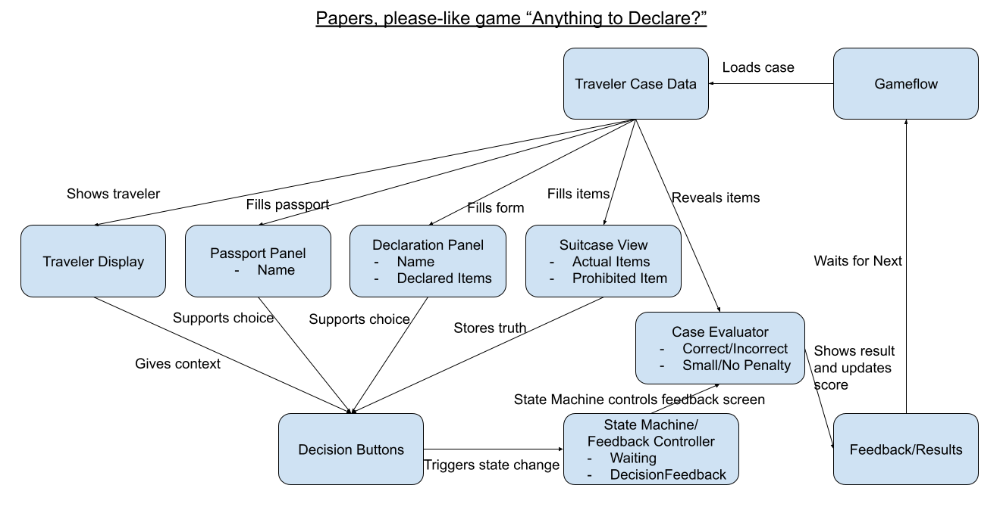
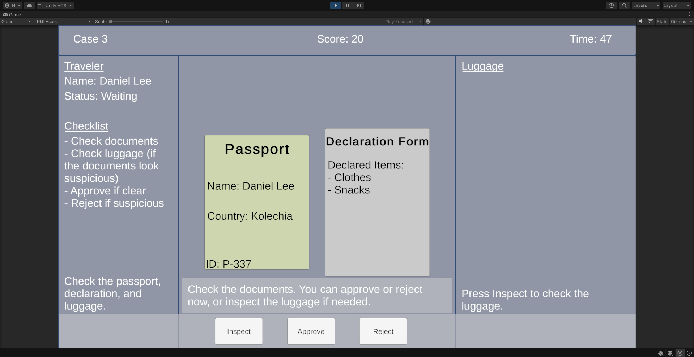
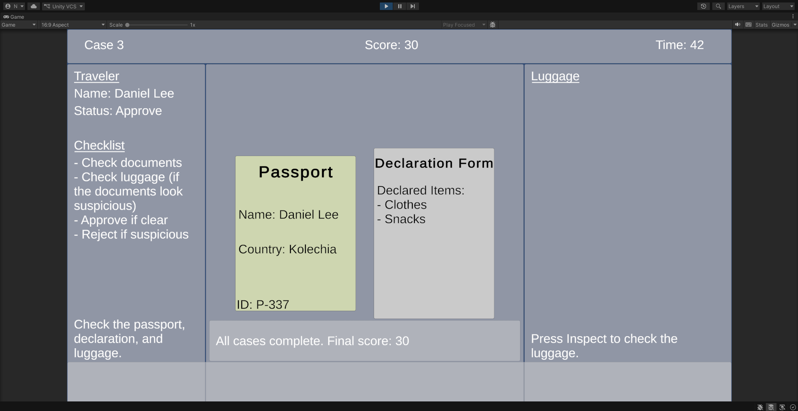
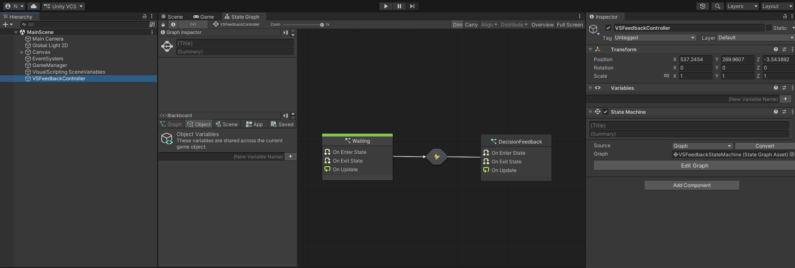
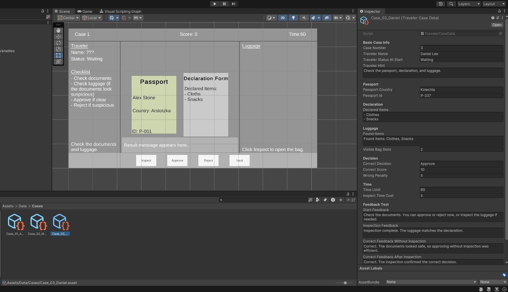

# GDIM33 Vertical Slice
## Milestone 1 Devlog
## Visual Scripting Graph Explanation
For this build, I used a Visual Scripting State Machine called `VSFeedbackStateMachine`. This graph has two states: `Waiting` and `DecisionFeedback`. The game starts in the `Waiting` state while the player is checking the traveler’s documents and luggage. When the player clicks Approve or Reject, my C# script sends a custom event called `DecisionMade` to the Visual Scripting graph. This event triggers the transition from `Waiting` to `DecisionFeedback`. I also added a Debug Log in the `DecisionFeedback` state to confirm that the state machine is working. The main gameplay is controlled by C#, but this graph handles the state change after the player makes a decision.

## Updated Break-down

I updated my break-down by adding the state machine system. In the previous version, the break-down mainly showed the documents, luggage, buttons, timer, score, and feedback UI. In the updated version, I added `VSFeedbackStateMachine` and connected it to the decision buttons and the feedback system. The Approve and Reject buttons call the main case manager script, and then the script sends the `DecisionMade` event to the state machine.

The state machine starts in the `Waiting` state while the player is checking the case. After the player chooses Approve or Reject, it moves to the `DecisionFeedback` state. This state is related to the feedback UI because the game shows whether the decision was correct or not after the decision is made. It is also related to the score system because the score changes at the same time. For Milestone 1, this state machine is simple, but it helps organize the game flow and can be expanded later with more states, such as Tutorial, Inspecting, Result, and NextCase.

## Milestone 2 Devlog
### 1. Feature summary and task break-down
For Milestone 2, I worked on adding multiple traveler cases instead of only one case. The player can now inspect three travelers, make decisions for each one, and see the final score after all cases are finished.

1. Create multiple case data
   1. Make three traveler cases.
   2. Give each case different passport, declaration, luggage, and correct decision data.
   3. Test that each case can show different text and luggage items.
   

2. Build case progression
   1. Add a current case number.
   2. Use the Next button to move to the next traveler.
   3. Reset the screen state when the next case starts.
   4. Hide buttons after the last case.
   

3. Add scoring and ending
   1. Give points for correct decisions.
   2. Subtract time when the player uses Inspect.
   3. Show the final score after all three travelers are judged.
   4. Test the full gameplay from Case 1 to the final result.

I accomplished the main version of this feature. The game now has three playable traveler cases, case progression, inspection time cost, scoring, and a final score screen.

### 2. Reflection on the W5 task break-down
The W5 task break-down helped because it made the feature smaller and easier to test. Instead of trying to build the whole system at once, I worked on case data, case progression, and scoring separately.

If I did this again, I would write clearer test steps for each part. For example, I would write exactly what should happen after pressing Next, Approve, Reject, and Inspect.

### 3. Bridge between Visual Scripting and code
My game uses both C# and Visual Scripting. The main gameplay logic is handled in `SimpleCase1Manager.cs`, which loads the case data, updates the UI, checks the player decision, changes the score, and moves to the next case.

Visual Scripting is used for the feedback state system. When the player chooses Approve or Reject, the C# decision logic connects to the `VSFeedbackController` State Graph, which changes from the `Waiting` state to the `DecisionFeedback` state. This helps show that the game has moved from normal case checking into the result/feedback phase.

### 4. Unity system used for Feature 3
For Feature 3, please grade my ScriptableObject system. The case data is stored in `Assets/Data/Cases`, and each `TravelerCaseData` asset contains information such as traveler name, passport data, declared items, found luggage items, correct decision, score values, and feedback text.

This system is useful because I can add or edit traveler cases without rewriting the main game code. It also makes the project easier to expand from three cases to five cases later.

## Milestone 3 Devlog
Milestone 3 Devlog goes here.
## Milestone 4 Devlog
Milestone 4 Devlog goes here.
## Final Devlog
Final Devlog goes here.
## Open-source assets
- [Modular Characters](https://kenney.nl/assets/modular-characters) by Kenney  
  License: Creative Commons CC0
- [Platformer Art: Candy](https://kenney.nl/assets/platformer-art-candy) by Kenney  
  License: Creative Commons CC0
- [Generic Items](https://kenney.nl/assets/generic-items) by Kenney
  License: Creative Commons CC0